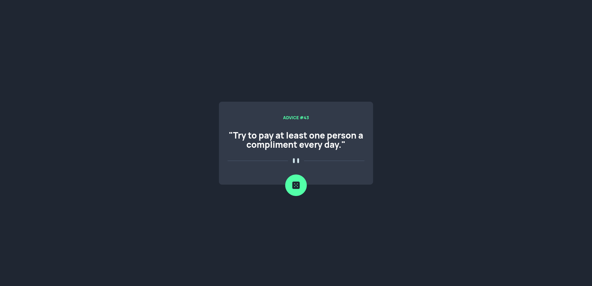
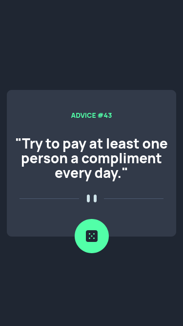

# Frontend Mentor - Advice generator app solution

This is a solution to the [Advice generator app challenge on Frontend Mentor](https://www.frontendmentor.io/challenges/advice-generator-app-QdUG-13db). Frontend Mentor challenges help you improve your coding skills by building realistic projects.

## Table of contents

- [Overview](#overview)
  - [The challenge](#the-challenge)
  - [Screenshot](#screenshot)
  - [Links](#links)
- [My process](#my-process)
  - [Built with](#built-with)
  - [What I learned](#what-i-learned)
  - [Continued development](#continued-development)
  - [Useful resources](#useful-resources)
- [Author](#author)
- [Acknowledgments](#acknowledgments)

## Overview

### The challenge

Users should be able to:

- View the optimal layout for the app depending on their device's screen size
- See hover states for all interactive elements on the page
- Generate a new piece of advice by clicking the dice icon

### Screenshot

#### Desktop

#### Mobile

### Links

- Solution URL: [Add solution URL here](https://your-solution-url.com)
- Live Site URL: [Live site](https://gamuchirais.github.io/advice-generator-app-main/)

## My process

### Built with

- Semantic HTML5 markup
- SASS
- JavaScript

### What I learned

- Integrating APIs 
- fetch() Javascript
- Promises
- Negative margin vs position absolute 
- Using let vs var vs const

### Continued development

- APIs 
- Positioning in CSS

### Useful resources

- [MDN fetch()](https://developer.mozilla.org/en-US/docs/Web/API/Fetch)

## Author

- Website - [Add your name here](https://www.your-site.com)
- Frontend Mentor - [@yourusername](https://www.frontendmentor.io/profile/yourusername)

## Acknowledgments

- [Catherine](https://github.com/catherineisonline). I was able to properly position the button and apply the hover effect by looking at her solution. Massive thank you!
